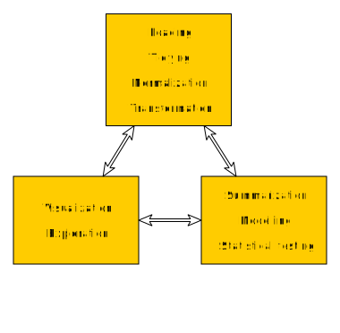

## R more

This day is a very fast tour of R as currently used.

The point is to get a taste of what exists in the R world.

R continues to evolve as better ways to work with data are found. In particular, packages by [Hadley Wickham](http://hadley.nz/) have recently revolutionized R: devtools, dplyr, tidyr, ggplot2

R is not the most consistent or friendly environment in which to work with data, but it is by far the most comprehensive.

## Working with data today is

### Exploratory

You can now produce very large, multi-dimensional data sets.

Understanding what you have requires a cyclic process of exploratation.

### Integrative

You may have many different views of a biological process: DNA, RNA, epigenetics, proteins, metabolome, cell morphology, ...

Your data can potentially be viewed in the context of a vast array of other data sets.

## Analysis cycle

## Analysis cycle

### Tidy and correctly transformed data

* Tidy data makes visualization and modelling fast and easy.
* Correctly transformed data brings out the signal in visualizations, and is necessary for correct modelling.

Key packages: readr tidyr dplyr

Specialized packages: rtracklayer

## Analysis cycle

*The greatest value of a picture is when it forces us 
 to notice what we never expected to see.*

-- John Tukey

### Visualization, exploration

* Suggests the need for transformation if necessary.
* Shows if any of the data is poor quality.
* Shows unexpected things in the data.
* Informs what relationships are important in the data for any modelling and statistical testing.

Key packages: ggplot2

## Analysis cycle

### Summarization, modelling, statistical testing

* Shrinks large data sets for more manageable visualization.
* Removal of confounding factors for visualization.
* Confirm what can be seen in visualization, tells us what *isn't* real in a visualization.
* Failures should prompt a rethink of tranformation, and further visualization to understand the data.

Key packages: dplyr

Basic R functions: mean, min, max, sd, apply, tapply, summary, lm, glm, anova, ...

Advanced/specialized packages: glht, broom, limma, edgeR

## Tidy data is key

Tidy data doesn't mean a neat presentation for a person to read, it means in the easiest form for the computer to work with.

R has been revolutionized by Hadley Wickham's formalization of this idea.

Similar to database normalization.

Data frames

* each row is a unit of observation
* each column is a single piece of information of a distinct type

## Not tidy

## Tidy

## Programming

In the introduction to R day, we mostly used R interactively.

Programming lets us tell the computer to do a whole lot of things without further instruction. Elements of this we will be looking at today:

* re-usable step-by-step procedures with `function`
* doing something "for each ..." with `for` loops
* making decisions with `if`
* running all the code in a .R file as a "script", or to load a "library" of functions

## Programming gets you to tidy

For a bioinformatician, the bulk of programming is often writing short scripts that do the repetitive grunt work to get your data into a tidy form. Bioinformatics is a mess of file formats, largely text based, haphazardly standardized.

The hard *algorithmic* work for most problems has been done for you. Once your data is tidy, R makes it easy to bring this to bear. (This is actually why S, and later R, exists!)

Of course if algorithms are your thing, there is plenty still to be done in computer science and statistics.

## Best practices

Science is sharing. Science is reproducable.

If you act as a model, your peers and students may surprise you with an unsuspected aptitude.

Therefore, whatever you do, show your code.

* Document your analysis in Rmarkdown.
* Share useful functions in packages, eg on GitHub.
* For reproducibility, record which versions of packages you used with sessionInfo().

## Today

Rmarkdown documents

Programming

* function/for/if
* packages

Tidying data and visualizing it

* tidyr, dplyr, ggplot2

Working with sequence and genomic feature data

* rtracklayer, GenomicRanges

Exploring data interactively

* shiny

