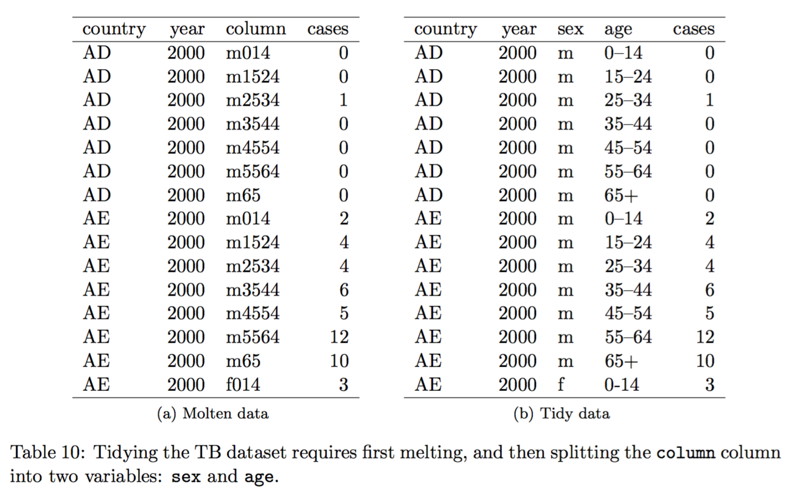
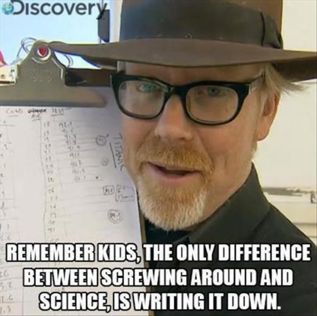

## R more

This day is a very fast tour of R as currently used.

The point is to get a taste of what exists in the R world.

R continues to evolve as better ways to work with data are found. In particular, packages by [Hadley Wickham](http://hadley.nz/) have recently revolutionized R: devtools, dplyr, tidyr, ggplot2

R is not the most consistent environment in which to work with data, but it is by far the most comprehensive.

## Working with data today is

### Exploratory

You can now produce very large, multi-dimensional data sets.

Understanding what you have requires a cyclic process of exploratation.

### Integrative

You may want to join together many different views of a biological process: DNA, RNA, epigenetics, proteins, metabolome, cell morphology, ...

Your data can potentially be viewed in the context of a vast array of other data sets.

 
In biology, a reference genome and gene annotations are essential as the key to joining different types of data.

## Analysis cycle

See also: [Hadley Wickham talking on this topic at useR! 2016](https://channel9.msdn.com/Events/useR-international-R-User-conference/useR2016/Towards-a-grammar-of-interactive-graphics)

## Analysis cycle

### Load, tidy, normalize and transform data

* Tidy data makes visualization and modelling fast and easy.
* Correctly normalized and transformed data brings out the signal in visualizations, and is necessary for correct modelling.

Key packages: readr tidyr dplyr

Specialized packages: Biostrings, rtracklayer

## Analysis cycle

*The greatest value of a picture is when it forces us 
 to notice what we never expected to see.*

-- John Tukey

### Visualization, exploration

* Suggests the need for normalization or transformation.
* Shows if any of the data is poor quality.
* Shows unexpected things in the data.
* Informs what relationships are important in the data for any modelling and statistical testing.

Key packages: ggplot2

## Analysis cycle

### Summarization, modelling, statistical testing

* Shrinks large data sets for more manageable visualization.
* Confirm what can be seen in visualization, tells us what *isn't* real in a visualization.
* What hypotheses does the data support and reject?
* Failures should prompt a rethink of normalization and tranformation, and further visualization to understand the data.

Key packages: dplyr

Base R functions: mean, min, max, sd, apply, tapply, summary, lm, glm, anova, ...

Advanced/specialized packages: multcomp, broom, limma, edgeR, glmnet

## Tidy data is key

Tidy data doesn't mean a neat presentation for a person to read, it means data in the easiest form for the computer to work with.

* use data frames
* each row is a unit of observation
* each column is a single piece of information
* each column is a distinct kind of information

Avoid complex structures, preferring one or more simple tables. 
 (Similar to database normalization.)

The experimental design is in the body of the table alongside the data, *not* in row names or column names.

## Not tidy ...

Example from: [Wickham, H. (2015) Tidy data. The Journal of Statistical Software, vol. 59.](http://vita.had.co.nz/papers/tidy-data.html)

## ... tidier ... tidy

## Programming

Programming (or scripting) lets us tell the computer to do a whole lot of things without further instruction.

* If every step of your analysis can run as a script, you have a complete record of what you have done.
* Changes are easily tested, a poor decision at an early stage is easily fixed.
* Today's big project becomes tomorrow's building block.

Elements of programming we will be looking at today:

* re-usable step-by-step procedures with `function`
* doing something "for each ..." with `for` loops
* making decisions with `if`
* running external software with `system`
* running all the code in a .R file as a "script", or to load a "library" of functions

## Best practices

Show your code.

Science is about sharing. Science is reproducable.

People may surprise you.

* Document analysis in Rmarkdown.
* Share useful functions in packages.
    * Version control (eg git, GitHub)
    * Documentation
    * Testing
    * `devtools::check`

 

* For reproducibility, record which versions of packages you used with `sessionInfo()`.

## Today

Rmarkdown documents

Programming

Tidying data and visualizing it

Sharing data interactively

### Also in notes

Working with sequence and genomic feature data

