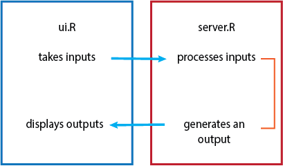

```{r setup, include=FALSE}
knitr::opts_chunk$set(echo = FALSE)
```

## Overview

* What is Shiny?

* Why should you use it and what for?

* Examples of shiny apps

* Basic setup of a Shiny app

* Tutorial: Let's make an app!

## What is Shiny

Shiny is an R package that makes it incredibly easy to build interactive web applications straight from your R code.

To use it, simply open up R Studio and:

```{r install_shiny, eval=FALSE, echo = T}
install.packages("shiny")
library(shiny)
```
Shiny essential wraps your R code and transforms it into a reactive, dynamic web app

## Another R package - What's so special about Shiny?

It's easier than learning HTML, CSS and JavaScript, although you can use those to build your own custom Shiny elements

You don't need to port any of your R code into another language in order to build a web app

Incredible flexibility, you can generate dynamic UI elements and create interactive plots

It adds reproducibilty to your graphs

**YOU DON'T NEED TO GENERATE A BILLION PLOTS MANUALLY** 

## Example apps

Here are some apps made by Monash bioinformaticians:

* Stuart's TCP app that went into his Nature paper: http://bioapps.erc.monash.edu.ezproxy.lib.monash.edu.au/TCP/

`Stuart K. Archer, Nikolay E. Shirokikh, Traude H. Beilharz, & Thomas Preiss. (2016). Dynamics of ribosome scanning and recycling revealed by translation complex profiling. Nature, Nature, 2016.`

* Paul's Varistran app: http://rnasystems.erc.monash.edu:3838/pfh/2015/demo-varistran/

[Varistran github page](https://github.com/MonashBioinformaticsPlatform/varistran)

## Structure of a Shiny App

A basic Shiny app consists of two R scripts within their own directory:

* ui.R - contains the code for the UI (user interface) elements i.e the visible part of the app 

* server.R - contains the code for all the calculations the app will need. Generates an output which is returned to the ui.

<center></center>

## ui.R

This script controls the layout and appearance of the app. The ui makes use of widgets to interact with data.

```{r, echo = T}
sliderInput("slider1", label = h4("This code will make a slider"),
                          min = 0, max = 100, value = 50)
```
```{r, echo=FALSE}
renderPrint({paste("The number selected by the slider is:", input$slider1)})
```


## Example widgets and layout

```{r, echo = F}
shinyUI(navbarPage("Navbar",
                   tabPanel("Widgets!",
                            selectInput("select", label = h3("Select box"), 
                                        choices = list("Choice 1" = 1, "Choice 2" = 2, "Choice 3" = 3), 
                                        selected = 1),
                            renderPrint({input$select}),
                            textInput("text", label = h3("Text input"), value = "Enter text..."),
                            renderPrint({input$text})
                   ),
                   tabPanel("More widgets!",
                            checkboxGroupInput("checkGroup", label = h3("Checkbox group"), 
                                               choices = list("Circle" = "circle", "Square" = "square", "Triangle" = "triangle"),
                                               selected = "circle"),
                            
                            renderPrint({ input$checkGroup })
                   )
)
)

```

## server.R

This script contains the code for building the app. 

Data processing, analysis, plotting, this all happens here.

Takes inputs from the ui and re-runs code chunks when the inputs change.

Let's have a look at a handy example from the [Shiny tutorial](http://shiny.rstudio.com/tutorial/lesson1/)

## Example Interactive Plot

```{r eruptions}
inputPanel(
  selectInput("n_breaks", label = "Number of bins:", choices = c(10, 20, 30, 50), selected = 20)#,
)

renderPlot({
  hist(faithful$eruptions, probability = TRUE, breaks = as.numeric(input$n_breaks),
       xlab = "Duration (minutes)", main = "Geyser eruption duration")
  
})
```

## Meanwhile, on the server side...

```{r, eval=FALSE, echo = T}
#UI code:
inputPanel(
  selectInput("n_breaks", label = "Number of bins:", choices = c(10, 20, 30, 50), selected = 20)
)

#Server code:
renderPlot({
  hist(faithful$eruptions, probability = TRUE, breaks = as.numeric(input$n_breaks),
       xlab = "Duration (minutes)", main = "Geyser eruption duration")
})
```
The server code plots a histogram for a dataset called faithful. It has an arguement for the number of breaks plotted which is dependent on the value from the selectInput.


## Let's get into Shiny!

[Shiny tutorial](http://biotraining.erc.monash.edu:3838/tutorial/)
