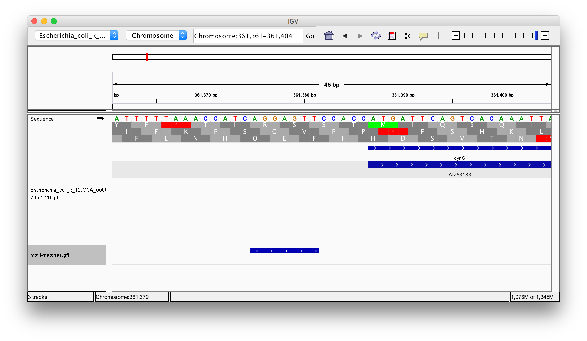

This section looks at working with sequences, primarily DNA sequences, and genomic features.

We will be using Bioconductor packages for this. Recall that most R packages are available on the CRAN package repository, and installed using `install.packages()`. Bioconductor is another specialized repository devoted to bioinformatics R packages. Here is how to install packages from Bioconductor:

```{r eval=FALSE}
# This loads the Bioconductor installer
source("https://bioconductor.org/biocLite.R")

# Install a basic set of packages
biocLite()

# Install further packages used in this tutorial
biocLite(c(
    "BSgenome", 
    "rtracklayer",
    "motifRG"
))

# If you want to install further packages in future, you can use
#   library(BiocInstaller)
#   biocLite( ... )
```

Bioconductor represents a different strand of current development in R, separate from the Hadley Wickham tidyverse. Where Hadley emphasizes the data frame above all else, Bioconductor uses a great variety of data types. It's the very opposite of tidy!

Nevertheless, Bioconductor is overwhelmingly *comprehensive*, and represents the most complete environment available for working with bioinformatic data currently available.

Bioconductor packages usually have useful documentation in the form of "vignettes". These are readable on the Bioconductor website, or within R:

```{r eval=FALSE}
vignette()
vignette(package="Biostrings")
vignette("BiostringsQuickOverview", package="Biostrings")
```


# DNA sequences and genomic ranges

```{r warning=FALSE, message=FALSE}
library(Biostrings)     # Provides DNAString, DNAStringSet, etc
library(BSgenome)       # Provides getSeq()
library(GenomicRanges)  # Provides GRanges, etc
library(rtracklayer)    # Provides import() and export()

library(dplyr)          # Pipe %>%

myseq <- DNAString("ACCATTGATTAT")
myseq
class(myseq)
reverseComplement(myseq)
translate(myseq)
subseq(myseq, 3,5)
as.character(myseq)
```


You can see a complete set of functions that work with DNAString with:

```{r eval=FALSE}
methods(class="DNAString")
```


Often we want to work with a list of sequences, such as chromosomes.

```{r}
myset <- DNAStringSet(list(chrI=myseq, chrII=DNAString("ACGTACGT")))

# A DNAStringSet is list-like
myset$chrII
# or myset[["chrII"]]
# or myset[[2]]
```


We may then wish to refer to regions of these sequences, often with an associated strand. This is done with the `GRanges` type. `GRanges` builds on `IRanges`, "integer ranges". An IRanges has a starts and ends. A GRanges additionally has sequence names and strand information.

```{r}
range1 <- GRanges("chrI", IRanges(start=3,end=5), strand="+")
getSeq(myset, range1)

range2 <- GRanges("chrI", IRanges(start=3,end=5), strand="-")
getSeq(myset, range2)

# GRanges are sometimes like vectors
c(range1, range2)

# Accessing GRanges data
seqnames(range1)
start(range1)
end(range1)
strand(range1)
as.data.frame(range1)

# GRanges can have metadata columns, so they are also like data frames
mcols(range1)$wobble <- 10
range1
mcols(range1)$wobble
range1$wobble

# Another way to create a GRanges
as("chrI:3-5:+", "GRanges")
```


## Challenge {.challenge}

Reverse complement the following DNA sequence and then translate to an amino acid sequence:

`TTCCATTTCCAT`


# Loading files

DNA sequences are generally stored in FASTA format, a simple text format. These can be loaded with `readDNAStringSet` from `Biostrings`. Let's load the genome of E. coli strain K-12, obtained from the Ensembl FTP site:

```{r}
seqs <- readDNAStringSet("r-more-files/Escherichia_coli_k_12.GCA_000800765.1.29.dna.genome.fa")
seqs

names(seqs)
# Our chromosome name is too verbose.
# Remove everything from the name after the first space.
names(seqs) <- sub(" .*","",names(seqs))
names(seqs)
```

Conversely, a DNAStringSet can also be written to a file with `writeXStringSet`.


Genome annotations are available in a variety of text formats such as GFF3 and GTF. They can be loaded with the `import` function from `rtracklayer`. This GTF file is also from Ensembl, and gives the locations of the genes in the genome, and features within them:

```{r warning=FALSE, message=FALSE}
features <- import("r-more-files/Escherichia_coli_k_12.GCA_000800765.1.29.gtf")
features
```

Conversely, a GRanges can be written to a file with `export`.


We can use these annotations to grab sequences from the genome.

```{r}
feat <- features[4,]
feat
feat_seq <- getSeq(seqs, feat)
feat_seq
translate(feat_seq)
```


The metadata columns let us query the GRanges, for example for a particular gene.

```{r}
subset(features, gene_name == "lacA")
# Equivalently:
#   features[features$gene_name == "lacA" & !is.na(features$gene_name),]
```

Note: `subset` is a generic R function similar to dplyr's `filter`. The second argument is special, in it you can refer to columns of the GRanges directly.

We could also get all features of a particular type.

```{r}
cds <- subset(features, type == "CDS")
cds
# Equivalently:
#   features[features$type == "CDS",]
```


# Further operations on GRanges

## Intra-range

Various useful manipulations of individual ranges are defined. 

```
?"intra-range-methods"
```

Note: How these make use of the strand is a little haphazard. For example flank() and resize() respect strand but shift() does not.

Earlier we translated a coding sequence. Coding sequences are terminated by a stop codon. Let's extend the CDS feature to include this.

```{r}
feat <- features[4,]
feat_stop <- resize(feat, width(feat)+3)
seq_stop <- getSeq(seqs, feat_stop)
translate(seq_stop)
```

`resize` can fix either the `fix="start"` or `fix="end"` of the sequence.

`flank` can be either flank the start (`start=TRUE`) or end (`start=FALSE`).

## Inter-range

```
?"inter-range-methods"
```

One compelling feature of GenomicRanges is that it is able to find overlapping ranges very quickly.

```{r}
query <- as("Chromosome:9500-10000:+", "GRanges")
hits <- findOverlaps(query, features, ignore.strand=TRUE)
hits
subjectHits(hits)
features[subjectHits(hits),]

findOverlaps(query, features, ignore.strand=FALSE)
```

With `findOverlaps`, we can use genomic location as the key when *joining* disparate types of data, so this is an important tool for *integrative* analysis.


## Challenge {.challenge}

What are E. coli's most common start and stop codons?

The start codon is the first three bases of the CDS, and the stop codon is the three bases following the end of the CDS.

Hint: Recall that we could get all CDS ranges with:

```{r eval=FALSE}
cds <- subset(features, type == "CDS")
```

Hint: Use `flank()` and `resize()` to manipulate these ranges.


# Finding a known motif

AGGAGGU is the Shine-Dalgarno sequence, which assists binding of the ribosome to a transcript.

```{r}
vmatchPattern("AGGAGGT", seqs)
```

`vmatchPattern` is strand specific. If we want matches on the reverse strand we need to also:

```{r}
vmatchPattern(reverseComplement(DNAString("AGGAGGT")), seqs)
```

Demanding an exact match here is overly strict. `vmatchPattern` has arguments allowing inexact matches.
Alternatively, there is a similar function for searching for a Position Weight Matrix pattern, `matchPWM`.

The following will search both strands, allowing one mismatch, and produce the result in convenient GRanges form:

```{r}
query <- DNAString("AGGAGGT")
max.mismatch <- 1

fwd <- vmatchPattern(query, seqs, max.mismatch=max.mismatch)
fwd <- as(fwd, "GRanges")
strand(fwd) <- "+"
rev <- vmatchPattern(reverseComplement(query), seqs, max.mismatch=max.mismatch)
rev <- as(rev, "GRanges")
strand(rev) <- "-"

complete <- c(fwd, rev)
complete

# Write to GFF file
export(complete, "motif-matches.gff")
```

We might then view this in the IGV genome browser:




# De novo motif finding

Let's try to "discover" the Shine-Dalgarno sequence for ourselves.

```{r cache=TRUE}
# Note: bacteria do not have introns
# In a eukaryote, you would need to merge CDS by transcript

size <- 20

initiation_regions <- flank(cds, size, start=TRUE)
initiation_seqs <- getSeq(seqs, initiation_regions)
names(initiation_seqs) <- initiation_regions$gene_id

# Look for any composition bias
library(seqLogo)
letter_counts <- consensusMatrix(initiation_seqs)
probs <- prop.table(letter_counts[1:4,], 2)
seqLogo(probs, ic.scale=FALSE)
seqLogo(probs)


# Generate a background set of sequences by shuffling 
shuffle <- function(dna) {
    strsplit(as.character(dna),"")[[1]] %>% 
        sample %>% 
        paste(collapse="") %>%
        DNAString
}

background_seqs <- lapply(initiation_seqs, shuffle) %>% DNAStringSet
names(background_seqs) <- paste0(names(background_seqs), "-shuffled")

```

```{r cache=TRUE, warning=FALSE, message=FALSE}
library(motifRG)

results <- findMotifFgBg(
    initiation_seqs, background_seqs, 
    both.strand=FALSE, start.width=4)

summaryMotif(results$motif, results$category)

motifHtmlTable(results)

refined <- refinePWMMotif(results$motifs[[1]]@match$pattern, initiation_seqs)
seqLogo(refined$model$prob)
```

There are many other motif finding programs available, outside of R. An alternative approach would be to construct the foreground and background sequences as above, then write them to FASTA files for use with an external program.

```{r}
writeXStringSet(initiation_seqs, "fg.fa")
writeXStringSet(background_seqs, "bg.fa")
```

For example MEME (which doesn't actually need background sequences):

```{r eval=FALSE}
system("meme -dna -maxsize 1000000 fg.fa")
```


# Next steps

We've seen just the smallest part of what Bioconductor has to offer in this space.

* [Most downloaded Bioconctor packages](http://bioconductor.org/packages/stats/)

Besides software, Bioconductor includes packages with data for model organisms, for example. The data is generally from these central repositories:

* NCBI's Entrez Gene gene database and Refseq reference sequences
* The EBI's Ensembl genome browser
* The UCSC genome browser

These organizations will generally obtain genome assemblies from the same ultimate sources. For example, all of the above use the Genome Reference Consortium's GRCh38 DNA sequence for homo sapiens. UCSC likes to call this "hg38" but it's the same DNA sequence. These DNA sequences serve as a common frame of reference. However the three organizations above will differ on their exact set of gene and transcript annotations, and all use a different gene and transcript id system. These annotations are also revised more often than the underlying DNA sequences.

This mess is partly due to American/European rivalry, and partly due to differing goals. The UCSC genome browser has always been about practicality and showing many lines of evidence. The others are more concerned with careful curation and standardization.

Some example packages:

### BSgenome.Hsapiens.UCSC.hg38 

Biostrings genome, Homo sapiens, from the UCSC browser, version hg38.

DNA for chromosomes, usable in the same way as the DNAStringSet used above.

### TxDb.Hsapiens.UCSC.hg38.knownGene

Transcript database, Homo sapiens, from UCSC browser, genome verison hg38, "knownGene" gene annotations.

GRanges information for genes and transcripts, much as we loaded from a GTF file above.

### org.Hs.eg.db

Organism Homo sapiens, primary key is Entrez Gene, database.

Translation of gene ids from various databases, assignment to GO terms, KEGG pathways, etc. Entrez Gene ids are used as the primary key.

### biomaRt 

Access to BioMart data, on the internet -- translation of gene ids, gene sets, gene information, etc.

### AnnotationHub

Access to experimental data which maps to locations on a genome, on the internet. Programmatic access to the sorts of tracks you would load up in the UCSC browser.


```{r}
sessionInfo()
```


